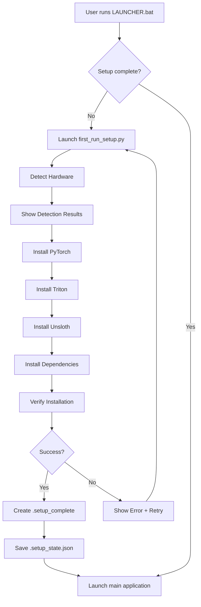

# Self-Installing Universal Launcher - Setup Guide

## Overview

The LLM Fine-tuning Studio now features a **professional, self-installing launcher** that automatically:
- ✅ Detects your hardware (CPU, RAM, GPU, CUDA)
- ✅ Installs all required dependencies with correct versions
- ✅ Handles different GPU generations (RTX 40xx, 30xx, older)
- ✅ Works on any Windows PC (with or without GPU)
- ✅ Recovers from errors gracefully
- ✅ Shows clear progress and error messages

## Quick Start

### For End Users

1. **Download the repository:**
   ```bash
   git clone https://github.com/yourusername/Local-LLM-Server.git
   cd Local-LLM-Server/LLM
   ```

2. **Run the launcher:**
   ```bash
   LAUNCHER.bat
   ```
   or double-click `launcher.exe` (if available)

3. **Wait for first-time setup:**
   - The setup wizard will appear automatically
   - It will detect your hardware
   - It will download and install all dependencies (~2.5 GB for PyTorch)
   - This takes 5-15 minutes depending on your internet speed
   - Watch the log for progress

4. **Application launches automatically** when setup completes!

### For Developers

If you're developing or testing:

```bash
# Check if setup is complete
python setup_state.py

# Verify installation manually
python verify_installation.py

# Run automated tests
powershell -ExecutionPolicy Bypass -File test_installation.ps1

# Force re-setup (for testing)
del .setup_complete
del .setup_state.json
LAUNCHER.bat
```

---

## System Requirements

### Minimum Requirements
- **OS:** Windows 10/11 (64-bit)
- **Python:** 3.8 or higher
- **RAM:** 8 GB minimum (16 GB recommended)
- **Storage:** 10 GB free space
- **Internet:** Required for initial setup

### Recommended for GPU Training
- **GPU:** NVIDIA RTX series (20xx, 30xx, 40xx) or Quadro
- **CUDA:** Driver 450+ (will auto-detect)
- **VRAM:** 8 GB minimum (16 GB+ recommended)

### Supported Hardware

| GPU Series | CUDA Version | Status |
|------------|--------------|--------|
| RTX 40xx (Ada Lovelace) | 12.4 | ✅ Fully Supported |
| RTX 30xx (Ampere) | 11.8 / 12.1 | ✅ Fully Supported |
| RTX 20xx (Turing) | 11.8 | ✅ Fully Supported |
| Quadro (T1000, A2000, etc.) | 11.8 | ✅ Fully Supported |
| GTX 10xx (Pascal) | 11.8 | ⚠️ Limited Support |
| CPU-only | N/A | ✅ Supported (slow training) |

---

## Architecture

### Component Overview

```
LLM/
├── LAUNCHER.bat              # Main entry point
├── launcher.exe              # Native Windows launcher (optional)
├── first_run_setup.py        # First-time setup wizard (GUI)
├── system_detector.py        # Hardware/software detection
├── smart_installer.py        # Intelligent dependency installer
├── verify_installation.py    # Installation verification
├── setup_state.py            # Setup state management
├── test_installation.ps1     # Automated test script
├── .setup_complete           # Marker file (created after setup)
└── .setup_state.json         # State file (hardware info, versions)
```

### Setup Flow



### Version Matrix

The installer uses a hardware-specific version matrix to ensure compatibility:

| CUDA Version | PyTorch | Triton | Torchvision | Torchaudio |
|--------------|---------|--------|-------------|------------|
| 12.4 | 2.5.1 | 3.0.0 | 0.20.1 | 2.5.1 |
| 12.1 | 2.5.1 | 3.0.0 | 0.20.1 | 2.5.1 |
| 11.8 | 2.5.1 | 3.0.0 | 0.20.1 | 2.5.1 |
| CPU | 2.5.1 | 3.0.0 | 0.20.1 | 2.5.1 |

**Why these versions?**
- PyTorch 2.5.1: Stable release, compatible with Unsloth
- Triton 3.0.0: Required by Unsloth (2.6.0+ breaks compatibility)
- Pinned versions prevent the `AttrsDescriptor` import error

---

## File Descriptions

### Core Setup Files

#### `LAUNCHER.bat`
Main entry point. Checks for `.setup_complete` marker. If not found, runs first-time setup.

**Key Features:**
- UTF-8 encoding for emoji support
- Virtual environment activation
- Error handling with helpful messages
- Retry logic for failed setups

#### `first_run_setup.py`
PySide6-based GUI wizard for first-time setup.

**Features:**
- Beautiful gradient UI
- Real-time hardware detection display
- Installation progress bars
- Live log viewer
- Retry button on failure
- Creates marker files on success

**Usage:**
```python
# Runs automatically from LAUNCHER.bat
# Can also run standalone for testing:
python first_run_setup.py
```

#### `system_detector.py`
Detects system components and capabilities.

**Detects:**
- Python version and location
- PyTorch (if installed) and version
- CUDA driver version
- GPU models and VRAM
- CPU and RAM
- Visual C++ Redistributables (Windows)

**Usage:**
```python
from system_detector import SystemDetector

detector = SystemDetector()
results = detector.detect_all()

# Check GPU
if results["cuda"]["available"]:
    print(f"GPU: {results['cuda']['gpus'][0]['name']}")
```

#### `smart_installer.py`
Intelligently installs dependencies based on hardware.

**Features:**
- GPU-specific version matrix
- Automatic CUDA build selection
- Fallback to CPU if GPU fails
- Retry logic for downloads
- Compatibility checks

**Key Methods:**
```python
installer = SmartInstaller()
installer.run_detection()
installer.install_pytorch()  # Auto-detects correct CUDA version
installer.install_dependencies()
results = installer.auto_install_all(progress_callback)
```

#### `verify_installation.py`
Comprehensive installation verification.

**Checks:**
- Python version (3.8+)
- PyTorch import and tensor operations
- CUDA availability and GPU operations
- Triton version (3.0.0)
- Unsloth import
- All ML libraries (transformers, datasets, peft)
- Hugging Face Hub connectivity
- PySide6 (GUI)

**Usage:**
```bash
# Command-line verification with report
python verify_installation.py

# Programmatic verification
from verify_installation import verify_all
success, checks = verify_all()
```

#### `setup_state.py`
Manages setup state persistence.

**State File Format:**
```json
{
  "setup_complete": true,
  "setup_date": "2024-12-24T12:45:00",
  "hardware": {
    "cpu": "Intel Core i9",
    "ram_gb": 64,
    "gpu": "NVIDIA RTX 4090",
    "cuda_driver": "560.94"
  },
  "installed_versions": {
    "python": "3.12.7",
    "pytorch": "2.5.1+cu124",
    "triton": "3.0.0"
  },
  "last_check": "2024-12-24T12:45:00"
}
```

**Usage:**
```python
from setup_state import SetupStateManager

manager = SetupStateManager()
if manager.is_setup_complete():
    state = manager.get_state()
    print(manager.get_hardware_summary())
```

---

## Usage Examples

### Example 1: Fresh Install on New PC

```bash
# PC: Windows 11, no Python, no GPU
# User downloads repo, runs LAUNCHER.bat

1. Setup wizard detects: No Python
2. Shows error: "Python not found. Install from python.org"
3. User installs Python 3.12, checks "Add to PATH"
4. Runs LAUNCHER.bat again
5. Setup wizard detects: Python 3.12, CPU-only
6. Installs: PyTorch 2.5.1 (CPU), Triton, dependencies
7. Creates .setup_complete marker
8. App launches
9. Future runs skip setup wizard
```

### Example 2: Gaming PC with RTX 4090

```bash
# PC: Windows 11, Python 3.12, RTX 4090, Driver 560.94

1. Runs LAUNCHER.bat
2. Setup wizard detects: RTX 4090, CUDA 12.4
3. Installs: PyTorch 2.5.1+cu124, Triton 3.0.0
4. Detects GPU in app
5. Training uses GPU acceleration
```

### Example 3: Developer PC with Mixed GPUs

```bash
# PC: Windows 11, Python 3.12, RTX A2000 + RTX 4090

1. Setup wizard detects both GPUs
2. Uses RTX 4090 for CUDA version decision (12.4)
3. Installs cu124 build (works with both)
4. Training page shows both GPUs
5. User can select either GPU for training
```

### Example 4: Version Conflict Fix

```bash
# PC has PyTorch 2.6.0 (incompatible)

1. Setup wizard detects PyTorch 2.6.0
2. Detects Triton version mismatch
3. Uninstalls PyTorch 2.6.0
4. Installs PyTorch 2.5.1 + Triton 3.0.0
5. Unsloth now works without errors
```

---

## Troubleshooting

### Common Issues

#### Issue: "Python not found"
**Solution:**
1. Install Python from [python.org](https://python.org)
2. Check "Add Python to PATH" during installation
3. Restart terminal
4. Run `python --version` to verify
5. Run LAUNCHER.bat again

#### Issue: Setup stuck on "Installing PyTorch"
**Cause:** Large download (2.5 GB)
**Solution:** 
- Wait 5-15 minutes
- Check internet connection
- Check antivirus isn't blocking downloads
- View detailed logs for progress

#### Issue: "ImportError: cannot import name 'AttrsDescriptor'"
**Cause:** Wrong Triton version
**Solution:**
```bash
# Delete setup marker
del .setup_complete
del .setup_state.json

# Run setup again
LAUNCHER.bat

# Or manually fix:
pip uninstall triton -y
pip install triton==3.0.0
```

#### Issue: GPU not detected
**Possible Causes:**
1. NVIDIA driver not installed or too old
2. Driver not in PATH
3. GPU not CUDA-capable

**Solution:**
```bash
# Check driver
nvidia-smi

# If not found, update driver from:
# https://www.nvidia.com/Download/index.aspx

# After updating, delete .setup_complete and run LAUNCHER.bat again
```

#### Issue: Setup fails with "No internet connection"
**Solution:**
1. Check internet connection
2. Check firewall/antivirus settings
3. Try again when connection is restored
4. Setup wizard has a Retry button

#### Issue: Application won't start after setup
**Solution:**
```bash
# Run verification
python verify_installation.py

# Check for specific errors
python -c "from desktop_app.main import MainWindow"

# If import errors, reinstall dependencies
python -m pip install -r requirements.txt --force-reinstall
```

---

## Advanced Usage

### Force Re-Setup

To test the setup wizard or fix a broken installation:

```bash
# Delete marker files
del .setup_complete
del .setup_state.json

# Run launcher
LAUNCHER.bat

# Setup wizard will run again
```

### Check Setup Status

```bash
# Quick check
python setup_state.py

# Detailed verification
python verify_installation.py

# Automated tests
powershell -ExecutionPolicy Bypass -File test_installation.ps1
```

### Manual Installation (Without Wizard)

If you prefer to install manually:

```bash
# Activate venv (if exists)
.venv\Scripts\activate

# Install PyTorch (choose your CUDA version)
# For CUDA 12.4:
pip install torch==2.5.1 torchvision==0.20.1 torchaudio==2.5.1 --index-url https://download.pytorch.org/whl/cu124

# For CPU-only:
pip install torch==2.5.1 torchvision==0.20.1 torchaudio==2.5.1 --index-url https://download.pytorch.org/whl/cpu

# Install Triton
pip install triton==3.0.0

# Install dependencies
pip install -r requirements.txt

# Install Unsloth
pip install unsloth

# Verify
python verify_installation.py
```

### Update Dependencies

To update to newer compatible versions:

```bash
# Check current versions
python setup_state.py

# Re-run setup to update
del .setup_complete
LAUNCHER.bat

# Or manually update
pip install --upgrade torch triton unsloth
```

---

## For Developers

### Testing the Setup System

```bash
# Run automated tests
powershell -ExecutionPolicy Bypass -File test_installation.ps1

# Test on clean VM (see TESTING_GUIDE.md)
# Test with different GPU configs
# Test offline mode
# Test error recovery
```

### Modifying Version Matrix

Edit `smart_installer.py`:

```python
class SmartInstaller:
    VERSION_MATRIX = {
        "cuda_12.4": {"torch": "2.5.1", "triton": "3.0.0", ...},
        # Add new versions here
    }
    
    GPU_COMPAT = {
        "RTX 4090": {"compute": "8.9", "recommended_cuda": "12.4"},
        # Add new GPUs here
    }
```

### Adding New Checks

Edit `verify_installation.py`:

```python
def verify_new_component() -> Tuple[bool, str]:
    try:
        import new_component
        return True, f"Component {new_component.__version__}"
    except:
        return False, "Not installed"

# Add to verify_all()
checks["New Component"] = verify_new_component()
```

---

## FAQ

**Q: Do I need to install anything before running LAUNCHER.bat?**
A: Only Python 3.8+. Everything else installs automatically.

**Q: How long does first-time setup take?**
A: 5-15 minutes depending on internet speed (downloading ~2.5 GB).

**Q: Can I use this without a GPU?**
A: Yes! It automatically installs CPU-only mode. Training will be slower.

**Q: Will it work on my older GPU?**
A: Most CUDA-capable GPUs are supported. Check the hardware compatibility table.

**Q: Can I skip the setup wizard?**
A: Not recommended. The wizard ensures correct versions for your hardware.

**Q: What if setup fails?**
A: Click "Retry" in the wizard or delete `.setup_complete` and run again.

**Q: Does it work on Linux/Mac?**
A: Currently Windows-only. Linux/Mac support planned for future versions.

**Q: How do I update the application?**
A: `git pull` then run LAUNCHER.bat. It will detect and update if needed.

**Q: Where are models stored?**
A: In `LLM/models/` and `LLM/fine_tuned_adapter/`

**Q: How much disk space is needed?**
A: ~10 GB base + model sizes (2-20 GB per model)

---

## Support

If you encounter issues:

1. **Check logs:** The setup wizard shows detailed logs
2. **Run verification:** `python verify_installation.py`
3. **Run tests:** `test_installation.ps1`
4. **Check TESTING_GUIDE.md** for known issues
5. **Report bugs** with system info and error logs

---

## Credits

- **PyTorch Team** - Deep learning framework
- **Unsloth** - Fast LLM fine-tuning
- **Hugging Face** - Models and transformers
- **PySide6/Qt** - GUI framework
- **NVIDIA** - CUDA and GPU support

---

## License

See main LICENSE file for details. This self-installing launcher system is part of the LLM Fine-tuning Studio project.

